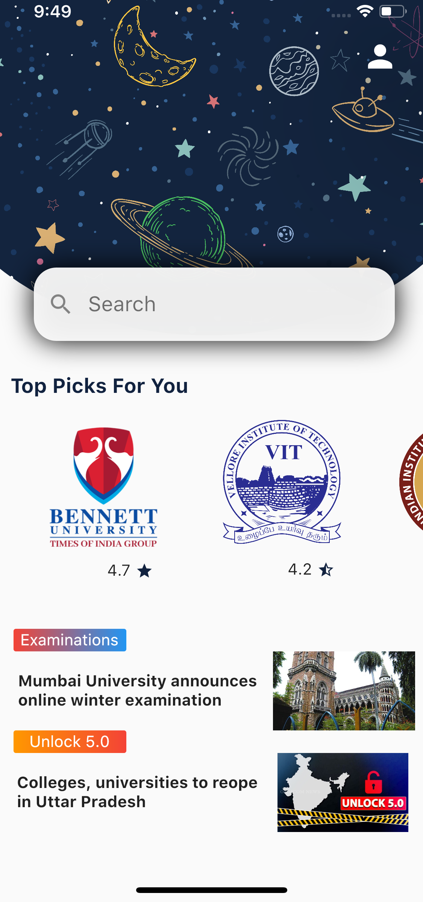
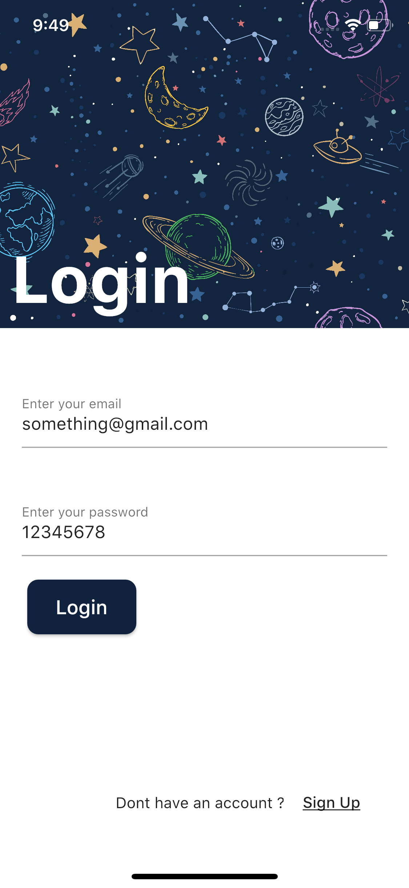
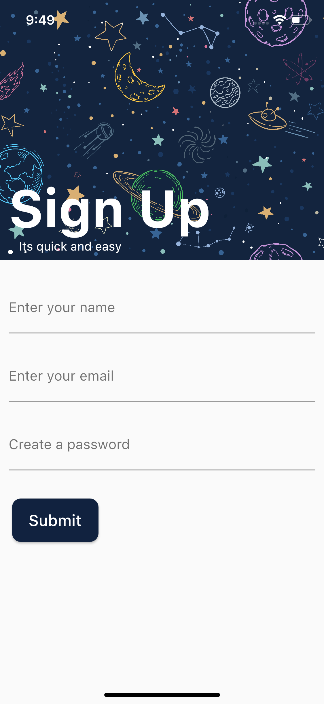
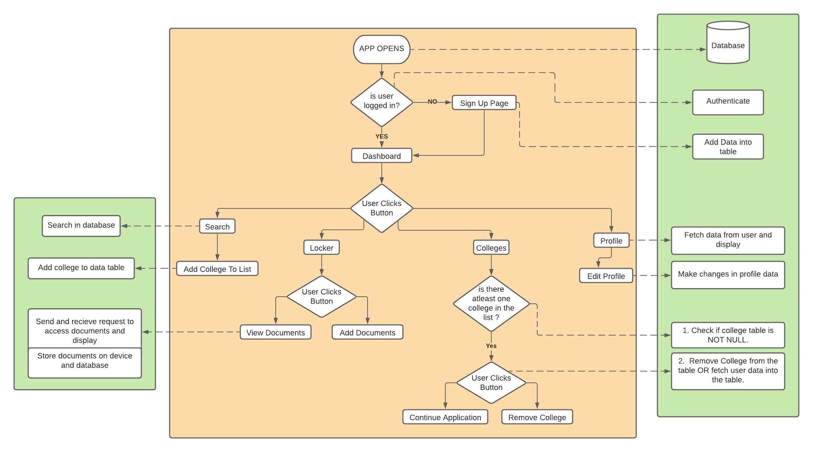

# One League
One League is  a platform to make college applications more easy and efficient for students. This is a one stop solution to all students applying for either an undergraduate or postgraduate education. We plan on connecting universities throughout India on this platform. With one username and password we want to give power in the hands of future students. The platform eliminates a constant need to fill the same details several times for different colleges. The App will also act as a guide for students to gather insights and knowledge about the universities they wish to apply to and the requirements that need to be fulfilled.
# Screenshots
  
# Working

